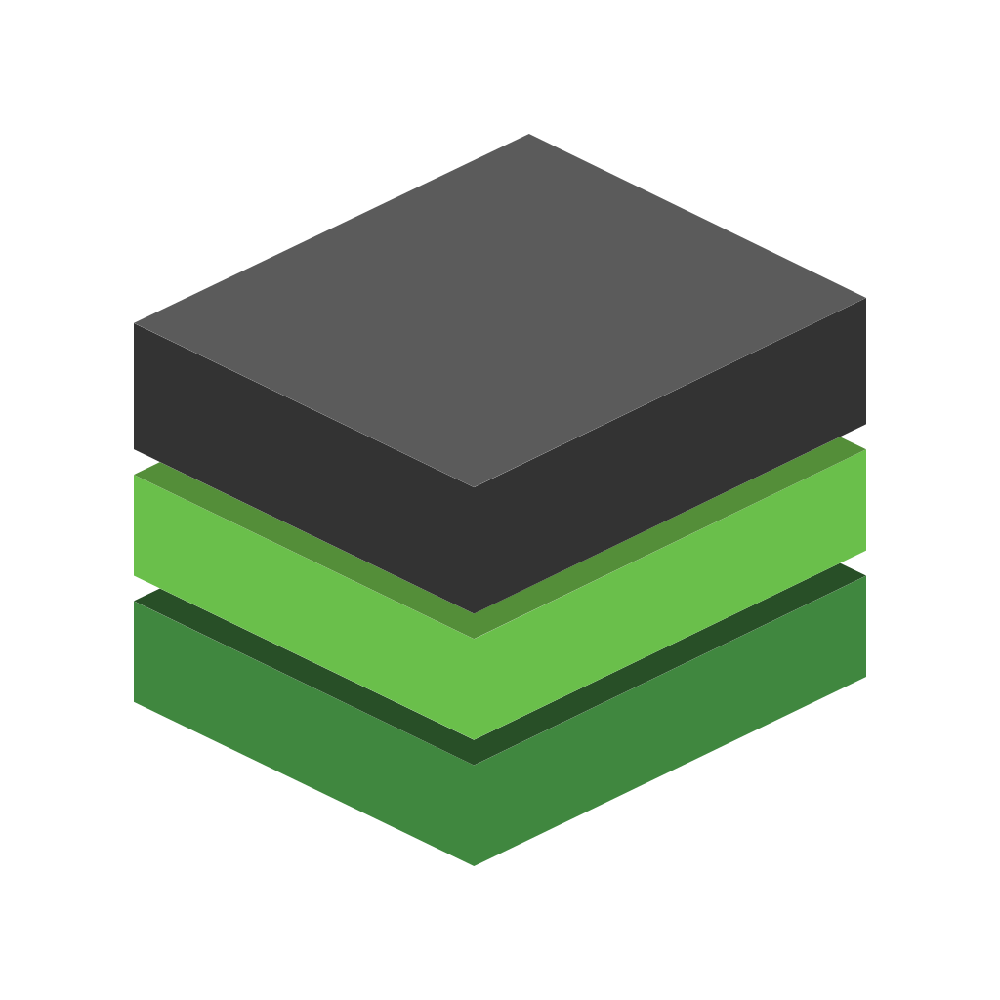
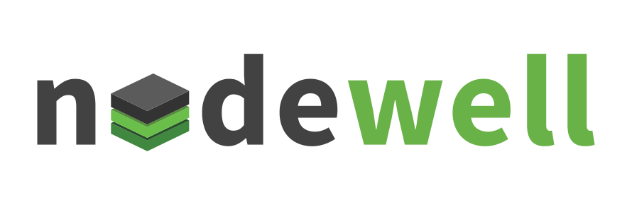

# @nodewell/brand

[![GitHub Release][badge-github]][url-github]
[![Travis CI][badge-travis]][url-travis]
[![Release Workflow][badge-release]][url-release]
[![Style Guide][badge-style]][url-style]
[![ISC License][badge-license-isc]][url-license-doc-isc]
[![CC-BY-4.0 License][badge-license-cc]][url-license-doc-cc4]
[![PRs Welcome][badge-contrib]][url-contrib-doc]

The official brand of [**@nodewell**][url-homepage].

## Assets

| Type | Asset                                                                                    |
| ---- | ---------------------------------------------------------------------------------------- |
| Logo |                                                                        |
| Lead |                                                                 |
|      | ........................................................................................ |

## Colors

- nodewell green: **#69B247**
  - ![#69B247][color-nodewell-green]
      
- nodewell gray: **#424344**
  - ![#424344][color-nodewell-gray]

## License

Dual license. You may use it under the [**ISC**][url-license-isc] license *or* 
the	[**CC-BY-4.0**][url-license-cc4] license.

- Software:
  - [ISC][url-license-doc-isc] @ [Richard King](www.richrdkng.com)

- Media:
  - [![CC-BY-4.0][image-cc4]][url-license-doc-cc4] @ [Richard King](www.richrdkng.com)

  <!--- References ============================================================================ -->

  <!--- Badges -->
  [badge-github]:      https://img.shields.io/github/release/nodewell/brand.svg?style=social
  [badge-travis]:      https://img.shields.io/travis/nodewell/brand.svg?style=flat-square
  [badge-style]:       https://img.shields.io/badge/style-standardjs-f3df49.svg?style=flat-square
  [badge-release]:     https://img.shields.io/badge/release-semantic--release-e10079.svg?style=flat-square
  [badge-license-isc]: https://img.shields.io/badge/license-ISC-blue.svg?style=flat-square  
  [badge-license-cc]:  https://img.shields.io/badge/license-CC--BY--4.0-blue.svg?style=flat-square
  [badge-contrib]:     https://img.shields.io/badge/PRs-welcome-brightgreen.svg?style=flat-square

  <!--- Colors -->
  [color-nodewell-green]: https://img.shields.io/badge/-%2369B247-69B247.svg?style=for-the-badge
  [color-nodewell-gray]:  https://img.shields.io/badge/-%23424344-424344.svg?style=for-the-badge
  
  <!--- Images -->
  [image-cc4]: https://i.creativecommons.org/l/by/4.0/88x31.png

  <!--- URLs -->
  [url-github]:          https://github.com/nodewell/brand
  [url-travis]:          https://travis-ci.org/nodewell/brand
  [url-style]:           https://standardjs.com
  [url-release]:         https://semantic-release.gitbook.io/semantic-release
  [url-license-doc]:     https://github.com/nodewell/brand/blob/master/LICENSE.md
  [url-license-doc-isc]: https://github.com/nodewell/brand/blob/master/LICENSE.md#isc-license
  [url-license-doc-cc4]: https://github.com/nodewell/brand/blob/master/LICENSE.md#creative-commons-attribution-40-international-public-license
  [url-contrib-doc]:     https://github.com/nodewell/brand/blob/master/.github/CONTRIBUTING.md
  [url-license-isc]:     https://choosealicense.com/licenses/isc/
  [url-license-cc4]:     https://creativecommons.org/licenses/by/4.0/
  [url-homepage]:        https://github.com/nodewell
